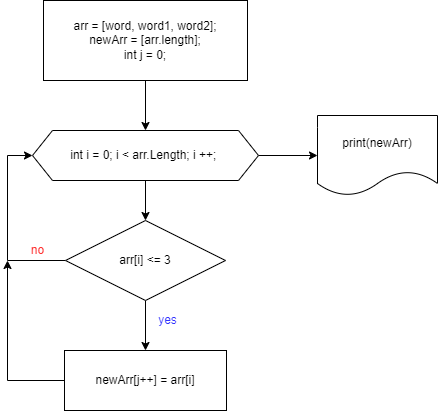

# Решение итоговой алгоритма на форирование массива из строк

Создаем 2 массива строк.

Один массив заполняем строками.

Просим пользователя ввести слова.

Заполняем при помощи  цикла __for__.

Создаем метод __formingNewArray__.

Определяем длину элемента массива. Если элемент имеет длину меньше или равную 3 символам, добавляем в пустой массив.

Выводим сформированный мвссив в консоль.

## Блок-схема алгоритма

